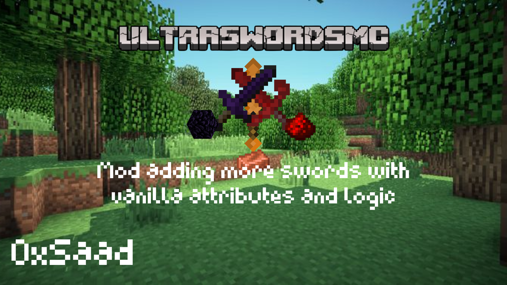
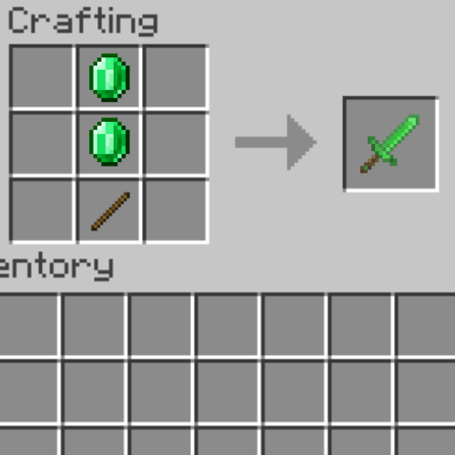
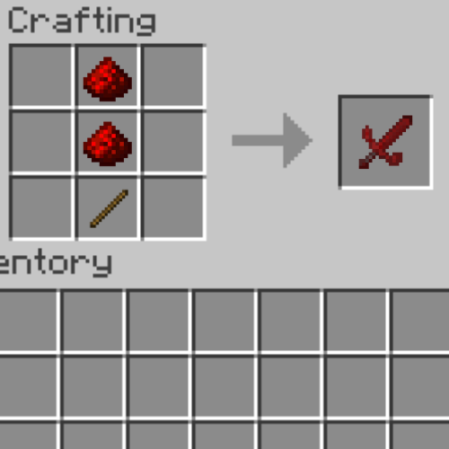

  

  
  

# UltraSwordsMC
Minecraft mod adding 4 swords with vanilla attributes and logic !
### Notice
this is the initial and prototype files of the mod...

## Mod Informations
- Supporting `1.20` and later updates
- Supporting **Spigot** only , may be supports **Forge** in later versions
- Add 4 Swords with 4 textures , crafting from vanilla materials `Obsidian` , `Emerald` , `Redstone` and `Copper` .

### Crafting
Below is crafting examples :
 

 

#### Credits
By : 0xSaad / Saad Almalki
